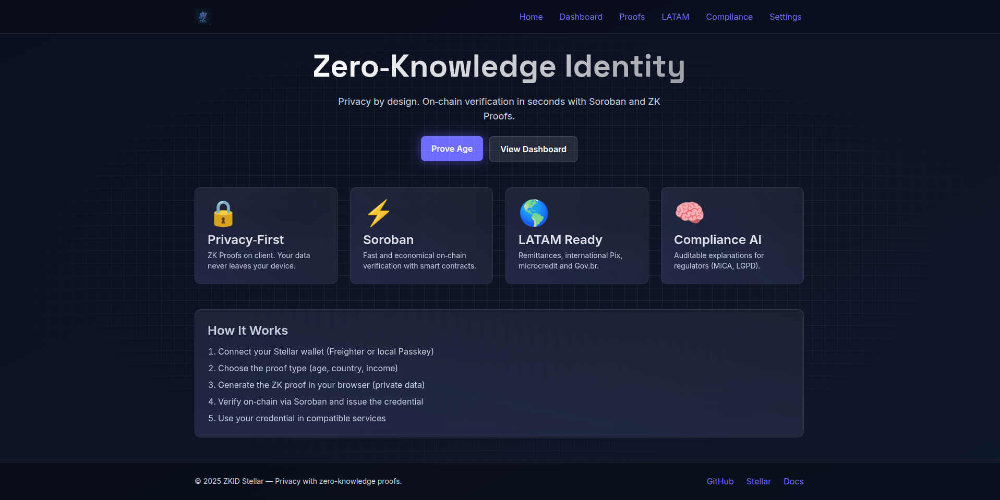

<p align="center">
  
</p>

# 🔐 ZKID Stellar

Zero-Knowledge Identity and Compliance with Passkeys  
Stellar Soroban + Circom + React

[]()
[](LICENSE)

---

<p align="center">
  
</p>

## 🎯 What is ZKID Stellar?

A complete decentralized identity and compliance system using **Zero-Knowledge Proofs (Groth16)** and **Stellar Passkeys**. It enables verification of attributes (age, country, income) without exposing personal data.

### ✨ Features

- 100% privacy-preserving — proofs generated on the client
- Soroban smart contracts — on-chain verification on Stellar
- Native passkeys — passwordless authentication (WebAuthn)
- Soulbound credentials — non-transferable NFTs
- Integrated compliance — sanctions and revocation oracle
- AI Compliance Assistant — ElizaOS for explainable compliance
- Production-ready artifacts — BN254 pairing, real transactions

---

## 📦 Monorepo Structure

- `contracts/` — Soroban smart contracts (Rust)
  - `verifier/` — on-chain Groth16 verifier (validates proofs)
  - `credential-registry/` — issuer/registry of non-transferable credentials
  - `compliance-oracle/` — sanctions/revocation/explanation oracle
- `circuits/` — Circom circuits (age, country, income)
- `sdk/zkid-sdk/` — TypeScript SDK (proof generation + contract clients)
- `frontend/zkid-app/` — React dApp (Vite + wallet + passkeys)
- `eliza_bot/` — ElizaOS AI agent (compliance assistant)
- `infra/` — infra files (Docker for dev)
- `docs/` — documentation, architecture, flows
- `scripts/` — helper scripts (compile, deploy, test)

---

## ✅ MVP Goals

1. Generate and verify an age proof (Circom + snarkjs) without exposing data
2. Validate on-chain via the Verifier contract (Groth16) on Soroban (testnet)
3. Issue a non-transferable credential bound to the passkey
4. Consume the credential in the frontend with passkeys onboarding

---

## 🌐 Current Testnet Deployment

- Verifier: `CBMUOMXPCWVYYA75GR6AIJTMUR3W6VOBUQCXJ5GDPRURKDETODUKJWSC`  
  Explorer: https://stellar.expert/explorer/testnet/contract/CBMUOMXPCWVYYA75GR6AIJTMUR3W6VOBUQCXJ5GDPRURKDETODUKJWSC
- Credential Registry: `CB4F5NMRYZ5GYTRPUOYDIU27J23NDNQCAWXZMAOWQ75OWQM7KOMAV7J5`  
  Explorer: https://stellar.expert/explorer/testnet/contract/CB4F5NMRYZ5GYTRPUOYDIU27J23NDNQCAWXZMAOWQ75OWQM7KOMAV7J5
- Compliance Oracle: `CDVZI3V7S3RIV3INQQRAPMR4FKIQJPR7NRJMDWET6LOSGBMFFCLLERVM`  
  Explorer: https://stellar.expert/explorer/testnet/contract/CDVZI3V7S3RIV3INQQRAPMR4FKIQJPR7NRJMDWET6LOSGBMFFCLLERVM

Notes:
- The Compliance Oracle is initialized with admin = the deployer public key.
- For local dev, prefer building contracts with the Stellar CLI (wasm32v1-none target) as shown below.

## 🚀 Quick Start

Requirements:
- Node 18+ / npm
- Rust + cargo + soroban-cli
- Circom 2.1.5+ / snarkjs 0.7.4+
- Git

Use the provided Makefile for common flows:

```bash
# 1) Install and build
make install
make build

# 2) Run tests
make test

# 3) Frontend development
make app-dev

# 4) Run AI assistant (optional)
npm run eliza:dev
```

More: see docs/README.md for the full documentation index.

---

## 🧭 How to Run (detailed)

### 1) Install dependencies
```bash
npm install
```

### 2) Build the SDK
```bash
npm run build -ws
```

### 3) Build circuits (requires circom/snarkjs)

Automated (recommended):
```bash
bash scripts/compile-circuits.sh
```

Manual steps (reference):
```bash
cd circuits

# Compile circuit to r1cs + wasm
circom age_verification.circom --r1cs --wasm --sym -l ../node_modules -o artifacts/age_verification

# Download Powers of Tau if needed
curl -o powersOfTau28_hez_final_12.ptau https://storage.googleapis.com/zkevm/ptau/powersOfTau28_hez_final_12.ptau

# Initial setup
snarkjs groth16 setup \
  artifacts/age_verification/age_verification.r1cs \
  powersOfTau28_hez_final_12.ptau \
  artifacts/age_verification/age_verification_0000.zkey

# Contribute randomness
snarkjs zkey contribute \
  artifacts/age_verification/age_verification_0000.zkey \
  artifacts/age_verification/age_verification.zkey \
  --name="First contribution" \
  -v

# Export verification key
snarkjs zkey export verificationkey \
  artifacts/age_verification/age_verification.zkey \
  artifacts/age_verification/verification_key.json

# Copy wasm to expected location
cp artifacts/age_verification/age_verification_js/age_verification.wasm artifacts/age_verification/

# Copy to frontend
mkdir -p ../frontend/zkid-app/public/circuits/artifacts/age_verification
cp artifacts/age_verification/age_verification.{wasm,zkey} \
   artifacts/age_verification/verification_key.json \
   ../frontend/zkid-app/public/circuits/artifacts/age_verification/
```

Notes:
- The SDK has mock fallbacks for development.
- You can run the frontend without compiling all circuits.

### 4) Build contracts and WASM artifacts
Recommended (Stellar CLI, produces wasm32v1-none compatible artifacts):
```bash
stellar contract build --package verifier
stellar contract build --package compliance_oracle
stellar contract build --package credential_registry
```

Alternative (legacy):
```bash
cd contracts
cargo build --release --target wasm32-unknown-unknown
```

### 5) Run tests
```bash
make test
```

### 6) Run frontend
```bash
cd frontend/zkid-app
npm run dev
```
Open http://localhost:5173

### 7) Run AI assistant (optional)
```bash
npm run eliza:dev
```
Open http://localhost:3000 (ElizaOS UI). See `docs/ELIZA_SETUP.md`.

---

## 📚 Documentation

See `docs/README.md` for the complete documentation in English, including:
- Quickstart
- Architecture
- Build & Scripts
- Soroban Deploy
- SDK & API examples
- Frontend structure
- Circuits guide
- Roadmap & Requirements

### Additional Reference
- Full extended English version: `README.en.md`
- Improvements log: `docs/CONTRACTS_IMPROVEMENTS.md`
- Project status: `PROJECT_STATUS.md`
- Requirements spec: `docs/REQUIREMENTS.md`

## 🔧 Makefile Targets
| Target | Description |
|--------|-------------|
| `make install` | Install all dependencies (root + SDK + frontend) |
| `make build` | Build SDK and Soroban contracts (release) |
| `make test` | Run SDK and contract tests |
| `make circuits-build` | Compile Circom circuits (artifact regeneration) |
| `make app-dev` | Start frontend dev server |
| `make deploy-testnet` | Run deployment script (testnet) |
| `make clean` | Remove build artifacts |

## 🧪 Contract Error Codes (Summary)
| Contract | Error Enum | Examples |
|----------|------------|----------|
| Verifier | `VerifierError` | `VkNotSet`, `EmptyProof`, `EmptyInputs`, `InvalidProofSize` |
| Credential Registry | `CredentialError` | `NotFound`, `AlreadyRevoked`, `Expired`, `Unauthorized` |
| Compliance Oracle | `ComplianceError` | `AdminNotSet`, `Unauthorized`, `AdminAlreadySet` |

All mutating/query functions that can fail return `Result<_, ErrorEnum>` instead of panicking.

## 🔐 Environment Variables (Typical)
```
SOROBAN_RPC=https://soroban-testnet.stellar.org:443
SOROBAN_NETWORK="Test SDF Network ; September 2015"
VERIFIER_ID=CBMUOMXPCWVYYA75GR6AIJTMUR3W6VOBUQCXJ5GDPRURKDETODUKJWSC
CREDENTIAL_REGISTRY_ID=CB4F5NMRYZ5GYTRPUOYDIU27J23NDNQCAWXZMAOWQ75OWQM7KOMAV7J5
COMPLIANCE_ORACLE_ID=CDVZI3V7S3RIV3INQQRAPMR4FKIQJPR7NRJMDWET6LOSGBMFFCLLERVM
```

## ✅ WASM Artifact Sizes (Approx)
| Contract | Size |
|----------|------|
| verifier.wasm | ~6.4 KB |
| credential_registry.wasm | ~13 KB |
| compliance_oracle.wasm | ~6.9 KB |

Release profile uses size optimizations (`opt-level="z"`, LTO, strip).

## 🛡️ Security Hardening (Recommended Next Steps)
- Add verification key hash anchoring (store hash + version).
- Introduce domain separator in public input commitment.
- Migrate events to typed `#[contractevent]` after SDK upgrade.
- Add multisig for compliance oracle admin key.
- Include circuit artifact SHA256 hashes in repo & README.

## 🗺️ Roadmap Snapshot
Short-term: Extra circuits, full test suites, typed TS bindings.
Mid-term: Event migration, multi-wallet UX, i18n.
Long-term: Cross-chain adapters, DAO governance, advanced composite proofs.

## 🛠️ Troubleshooting Quick Tips
| Symptom | Likely Cause | Fix |
|---------|--------------|-----|
| Proof rejected | VK mismatch or malformed inputs | Re-export verification key & confirm circuit version |
| Deploy fails | Unfunded account | Use testnet friendbot to fund address |
| Event warnings | Legacy API usage | Upgrade SDK and migrate events later |
| Revoke fails | Wrong caller address | Ensure owner calls `revoke` with auth |

## 🔍 Integrity & Verification
- Maintain a manifest of circuit artifact hashes.
- Pin dependency versions in `package.json` / `Cargo.toml`.
- Consider reproducible build script producing deterministic wasm.
- Optional: publish SRI hashes for frontend-loaded wasm.

---
For the exhaustive English documentation, consult `README.en.md`.

---

## 🔒 Security & Privacy

- Proofs are generated on the client; documents never leave the device
- Credentials can be revoked and have expiration
- No PII is stored on servers
- On-chain events are auditable by regulators

---

## 📄 License
MIT — see [LICENSE](LICENSE)

## 🤝 Contributing
See [CONTRIBUTING.md](CONTRIBUTING.md) for guidelines.

---

## 🔗 Useful Links
- Stellar Docs: https://developers.stellar.org/docs
- Soroban Docs: https://soroban.stellar.org
- Circom: https://docs.circom.io
- snarkjs: https://github.com/iden3/snarkjs

## 📬 Support
- Issues: GitHub Issues
- Discussions: GitHub Discussions
- Email: (to be added)

---

## 🧩 Scaffold Stellar Integration

This project uses a Scaffold-style configuration to centralize Soroban contract metadata and generate typed TypeScript clients automatically.

### Configuration File
The `stellar.toml` at the repository root declares networks, contract build commands and deployed IDs:

```toml
[global]
network = "testnet"
rpc_url = "https://soroban-testnet.stellar.org"
network_passphrase = "Test SDF Network ; September 2015"

[contracts.verifier]
path = "contracts/verifier"
build_command = "stellar contract build --package verifier"
wasm_path = "target/wasm32v1-none/release/verifier.wasm"

[contracts.credential_registry]
path = "contracts/credential-registry"
build_command = "stellar contract build --package credential_registry"
wasm_path = "target/wasm32v1-none/release/credential_registry.wasm"

[contracts.compliance_oracle]
path = "contracts/compliance-oracle"
build_command = "stellar contract build --package compliance_oracle"
wasm_path = "target/wasm32v1-none/release/compliance_oracle.wasm"

[environments.testnet.contracts]
verifier = { id = "CBMUOMXPCWVYYA75GR6AIJTMUR3W6VOBUQCXJ5GDPRURKDETODUKJWSC" }
credential_registry = { id = "CB4F5NMRYZ5GYTRPUOYDIU27J23NDNQCAWXZMAOWQ75OWQM7KOMAV7J5" }
compliance_oracle = { id = "CDVZI3V7S3RIV3INQQRAPMR4FKIQJPR7NRJMDWET6LOSGBMFFCLLERVM" }

[client]
output_dir = "packages"
languages = ["typescript"]
[client.typescript]
generate_clients = true
```

### Generated Contract Clients
Clients are produced under `packages/` (one folder per contract) via Stellar CLI bindings:

```bash
stellar contract bindings typescript \
  --wasm target/wasm32v1-none/release/verifier.wasm \
  --output-dir packages/verifier --overwrite
```

Repeat for each contract (credential_registry, compliance_oracle). They expose a `Client` class with typed methods returning `AssembledTransaction<T>` objects supporting `simulate()` and `signAndSend(signer)`.

### SDK Re-Exports
The SDK (`sdk/zkid-sdk/src/client/contracts.ts`) re-exports the generated clients to avoid dependency duplication:

```ts
export { Client as VerifierClient } from 'verifier';
export { Client as CredentialRegistryClient } from 'credential_registry';
export { Client as ComplianceOracleClient } from 'compliance_oracle';
```

### Frontend Usage
Instantiate clients with contract IDs and passphrase, inject a wallet signer (Freighter / fallback passkey) and call methods:

```ts
import { VerifierClient } from 'zkid-sdk/client/contracts';
import { Networks } from '@stellar/stellar-sdk';

const verifier = new VerifierClient({
  contractId: process.env.VERIFIER_ID!,
  networkPassphrase: Networks.TESTNET,
  rpcUrl: 'https://soroban-testnet.stellar.org'
});

// Example read (no signature)
const version = await (await verifier.version()).simulate();

// Example write (with signer)
const signer = await getWalletSigner(); // returns { publicKey, signTransaction(xdr) }
const tx = await verifier.verify_identity_proof(proofBytes, publicInputsBytes);
const result = await tx.signAndSend(signer);
```

### Regeneration Workflow
Run after any contract logic change:

```bash
make build            # builds Rust contracts (wasm32v1-none)
npm run build:clients  # regenerates TypeScript clients
npm run build -w sdk/zkid-sdk  # rebuild SDK consuming clients
```

### Wallet Signing Abstraction
Frontend wraps Freighter or a deterministic passkey fallback returning `{ signTransaction(xdr), publicKey }`, passed directly into `signAndSend`.

### Code Splitting
`vite.config.ts` uses `manualChunks` to isolate heavy dependencies (`@stellar/stellar-sdk`, `snarkjs`, contract clients), improving initial load.

### Benefits
- Strong type safety for all contract calls
- Easy regeneration when contracts evolve
- Cleaner imports via SDK shim
- Reduced integration friction for frontend & tests

If deploying to mainnet later, add the new IDs to `[environments.production.contracts]` in `stellar.toml` and rebuild clients.

---